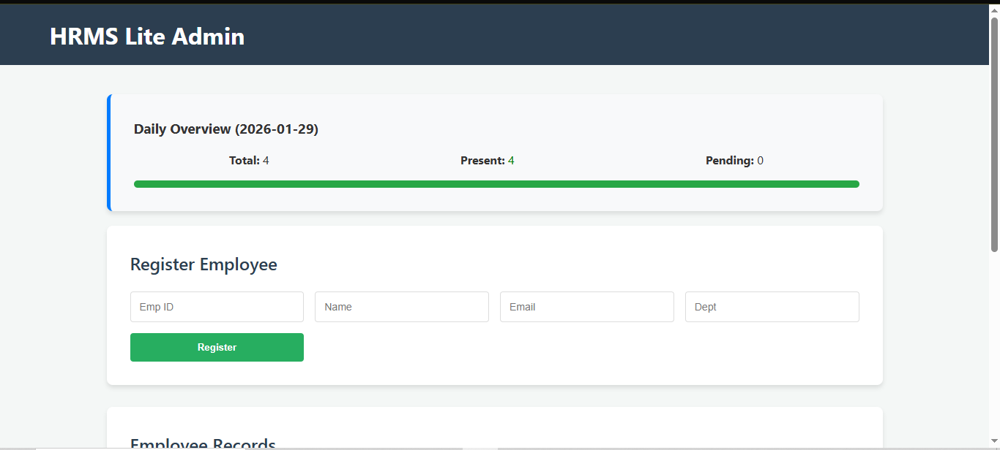
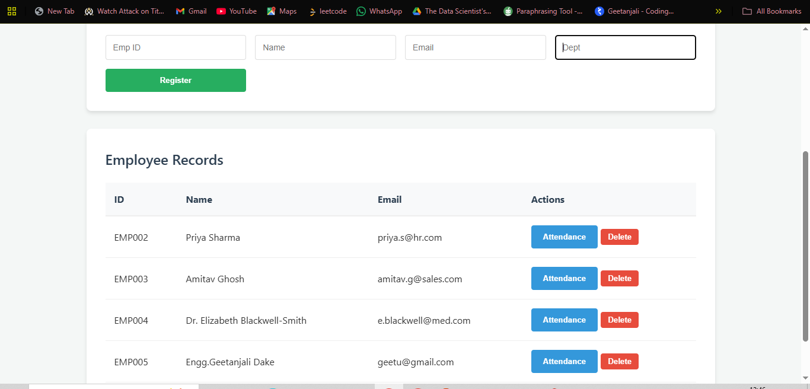
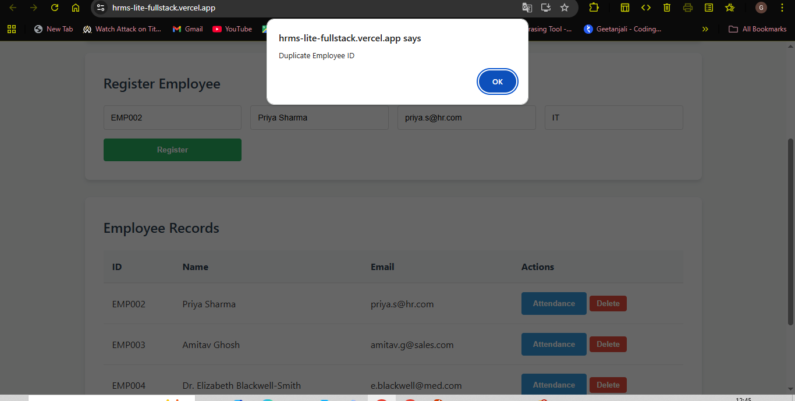

# 🚀 HRMS Lite: Full-Stack Employee Management System

## 📌 Submission Requirements
As per the assessment guidelines, this repository contains the complete full-stack solution:
- **Live Application URL**: [https://hrms-lite-fullstack.vercel.app](https://hrms-lite-fullstack.vercel.app)
- **Hosted Backend API**: [https://hrms-lite-fullstack-pl4h.onrender.com](https://hrms-lite-fullstack-pl4h.onrender.com)
- **GitHub Repository**: [https://github.com/7693geetu/hrms-lite-fullstack](https://github.com/7693geetu/hrms-lite-fullstack)

## 📸 Application Screenshots

### Admin Dashboard & Registration
The core interface allows for real-time tracking of employee presence and a quick registration form.

### Features Gallery
| Daily Attendance | Employee Records | System Overview | Duplicate ID Not Allowed |
| :---: | :---: | :---: | :---: |
|  |  |  |  |

> **Note:** The interface provides a live "Daily Overview" including Total, Present, and Pending counts.

## 📌 Project Overview
The **HRMS Lite** is a clean, working solution designed to manage employee registration and track daily attendance. It bridges the gap between a modern React UI and a Python-based REST API, providing real-time data persistence.

## 🛠️ Tech Stack Used
- **Frontend**: React.js (JavaScript), deployed on **Vercel**.
- **Backend**: Python (Flask), deployed on **Render**.
- **Database**: SQLite (Local) / API-driven state management for hosted environment.
- **Server**: Gunicorn (WSGI HTTP Server for production).

## 🚀 Steps to Run Locally
1. **Clone the Repo**:
   `git clone https://github.com/7693geetu/hrms-lite-fullstack.git`
2. **Setup Backend**:
   - `cd backend`
   - `pip install -r requirements.txt`
   - `python app.py` (Runs on http://localhost:5000)
3. **Setup Frontend**:
   - `cd frontend/my-app`
   - `npm install`
   - `npm start` (Runs on http://localhost:3000)

## ✨ Bonus Features Implemented
I have implemented the following bonus features to enhance the application's stability and utility:
- **Basic Dashboard Summary**: Real-time cards displaying Total Employees, Present Today, and Absent Today counts.
- **Employee Table**: A dynamic table showing all registered employees fetched from the database.
- **Stability Fixes**: Implemented a dynamic `API_URL` environment variable to ensure seamless switching between local and live environments.

## 💡 Assumptions & Limitations
- **Cold Start**: Since Render's free tier is used, the backend "sleeps" after 15 minutes of inactivity. The application includes a "Loading..." state to handle this ~60s spin-up time.
- **Data Persistence**: Designed for daily tracking; the current prototype resets attendance views on fresh deployment cycles if using ephemeral storage.

## 🤝 Conclusion
This assignment follows the "clean, working solution" philosophy. It avoids over-engineering while ensuring 100% stable deployment and cross-origin communication (CORS) between Vercel and Render.
